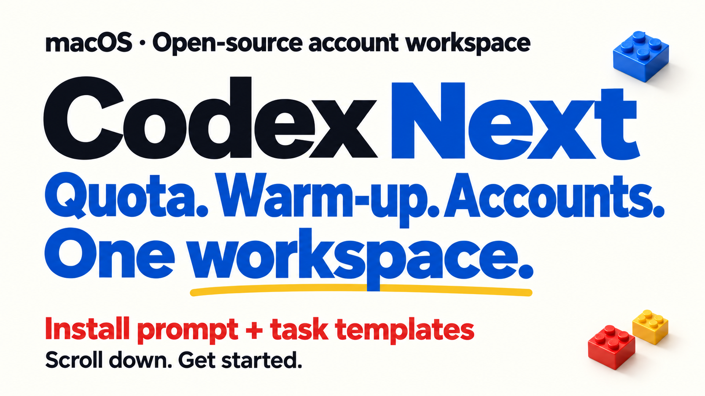
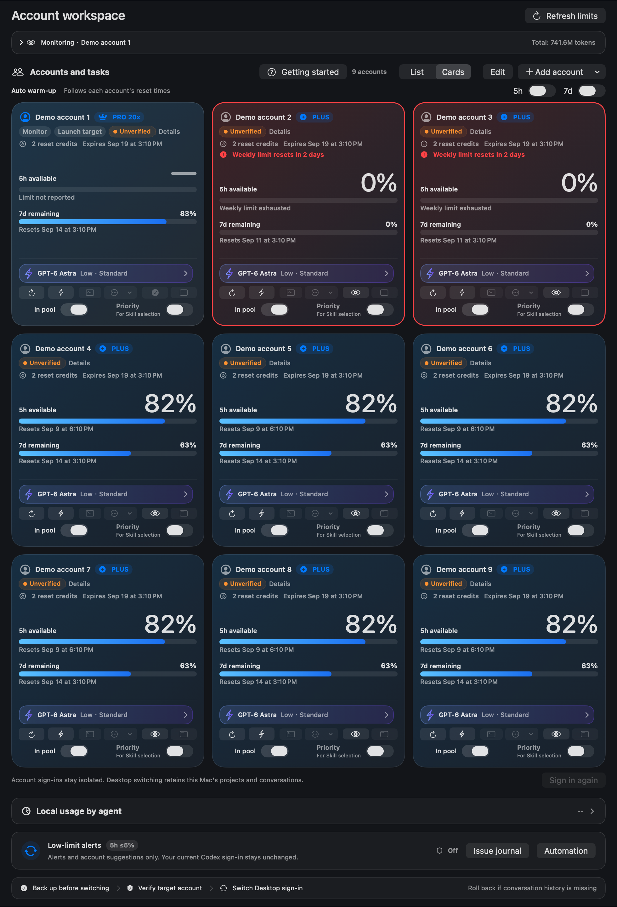

# Codex Account Manager Next

[中文](README.md) | **English**



Before working in Codex, you often repeat the same checks: which account has quota, when it resets, which model to use, and whether another task is already using that account.

Next puts those checks in one native macOS workspace. One account can track quota and schedule warm-up. Multiple accounts can keep separate CLI environments and execution preferences.

**An installation prompt and four practical task prompts are below.** Current version: **0909v4 · 9.5.15 (29)**. This update publishes source and images and was installed locally; a downloadable package for this version has not been published.

[](https://github.com/BLACKIELF/codex-account-manager-next/actions/workflows/ci.yml)

[](LICENSE)

## Install it with your local agent

```text
Install or upgrade Codex Account Manager Next from https://github.com/BLACKIELF/codex-account-manager-next. Read the README and check the system, dependencies and existing installation first. For an upgrade, record the current settings, wait for Next's own operations to finish, back up the app and replace it at the same path. Preserve accounts, dispatch participation, execution preferences and the current Codex sign-in. Verify the actual running version and restored settings. Do not terminate other CLI tasks or start real tasks, switch accounts or send notifications just to test the installation. Let me complete any official sign-in manually.
```

Requires macOS 13+, a working Codex sign-in and Xcode Command Line Tools. A single account can start with read-only monitoring. CLI launch and warm-up also require a configured local Hub and account mapping; those controls remain blocked when required evidence is missing. Installing Next does not configure a Hub automatically.

To build yourself:

```sh
git clone https://github.com/BLACKIELF/codex-account-manager-next.git
cd codex-account-manager-next
make build
```

The result is `build/CodexAccountManagerNext.app`. Building does not install or launch it. Back up an existing installation and replace it at its original path. Local builds use ad-hoc signing; no Apple-notarized download is provided for this version.

## Start with the workspace



See remaining 5-hour and weekly quota alongside reported reset times. A missing window shows “—”; it is not described as unlimited. Switch between a compact list and cards without changing account order or behavior.

Refresh each account, set its model and open an isolated CLI environment. Saved preferences apply to subsequent tasks. New accounts default to **GPT-6 Astra / Low / Standard**; actual availability depends on the account and provider.

> Screenshots are native renders of this version's production SwiftUI views using synthetic accounts, quota and dates. “Unverified” means that the demo is not connected to a Hub. [Image provenance and prompts](docs/images/0909v4/README.md)

## Stop watching the reset countdown

Five-hour and weekly warm-up have separate switches. Next refreshes official quota first, checks identity and occupancy, then sends one minimal request when the checks pass.

Next must remain running on an awake, connected Mac. Warm-up consumes quota. Busy accounts, exhausted weekly quota or uncertain state defer the attempt; failures are rechecked after a delay. A successful request followed by 100% remaining quota no longer causes repeated warm-up every minute.

Dispatch participation only controls new task eligibility. Excluded accounts still refresh and follow the global warm-up switches. Warm-up does not add quota or redeem reset credits.

## Reserve before starting

With the companion coordination protocol, a new call reserves its account and real project directory before environment checks and process launch. Other cooperating calls can read that reservation immediately; Next refreshes its view roughly every ten seconds.

| State | Meaning |
|---|---|
| Online · preparing | Reserved; execution has not been proven |
| Online · running | Actual process or Hub execution evidence exists |
| Online · maintenance | Warm-up or an authorized maintenance reservation |
| Ended · awaiting acceptance | The process ended; its output still needs review |
| Unverified | Evidence is incomplete and occupancy remains blocked |

Concurrent reservations for the same account or real project directory are rejected. An expired heartbeat does not make an account idle. Observations, fixes and verification are appended with dates to one issue journal, accessible from the workspace.

This requires cooperating launchers. Legacy CLI sessions, native interactive terminals and Hub API calls that bypass the Skill are not automatically registered; they still require process checks. Next does not adopt them. [Protocol and integration requirements](docs/dispatch-coordination.md)

## Four prompts to use after setup

Give these to an agent with the necessary local tools and configuration. They are not a built-in chat interface in Next.

**1. Check before work**

```text
Read Next's current 5-hour and weekly remaining quota, reset times in my time zone, task occupancy and execution preferences. Distinguish fresh evidence, old snapshots and unknown state. Do not start a task.
```

**2. Use a specific account**

```text
Use account A for the currently authorized task. Verify the required tools, project directory and identity; reserve the account as soon as preparation starts, then refresh quota and check occupancy. Use Next's saved execution preferences and do not silently substitute another account. Collect and validate the output as soon as execution ends, then release the reservation.
```

**3. Diagnose missing warm-up**

```text
Check Next's warm-up switches, recent success and failure records, official reset times, weekly quota and occupancy. Append the findings with today's date to the same issue journal. Start with the smallest diagnostic check instead of repeatedly sending real warm-up requests.
```

**4. Restore settings after an upgrade**

```text
Record Next's settings, account order, participation and model preferences before upgrading. Wait for existing calls to finish, reserve the accounts for maintenance and replace the app at the same path. Verify the version, restore settings and admission controls, and release all maintenance reservations. Do not start test tasks.
```

## Defaults for a new installation

| Setting | Default |
|---|---|
| Language, layout, appearance | Chinese, list, system appearance, standard palette |
| Menu bar | Classic, weekly remaining quota, no reset countdown |
| Shortcut | ⌘U |
| New account execution | GPT-6 Astra / Low / Standard |
| Window maintenance | Five-hour and weekly warm-up enabled |
| Alerts | Low quota, local notifications, Feishu and both quota event options enabled |
| Low quota thresholds | 5-hour ≤5%; weekly <10%, independently adjustable |

Saved choices take precedence, including disabled features. New users still receive onboarding. Local notifications require macOS authorization; Feishu requires a configured robot. An enabled switch does not prove delivery. New accounts participate in dispatch by default; existing participation choices are preserved.

## What changed

0909v4 aligns new-user defaults, fixes per-card quota scaling and shows maintenance occupancy for excluded accounts. It includes 0909v3's shared reservations, warm-up mutual exclusion, repeated warm-up fix, dated issue journal, prompt result collection and eligible-account priority ordering.

Validation covers 26 pure test groups, 22 Python coordination tests, Python/Swift locking interoperability and nine-account layouts at three widths in light and dark appearance. Local replacement and settings restoration are checked separately. These tests do not prove a full official reset cycle, real dispatch, Desktop switching or notification delivery.

[Release notes](docs/release-notes-v9.5.15.md) · [Changelog](CHANGELOG.md) · [Detailed guide (Chinese)](docs/usage-guide.md)

## The rest of the workspace

Single-account menus, full PNG exports, labels and ordering, model and reasoning selection, Standard/Fast, apply-to-all preferences, isolated Chrome sign-in, explicit Desktop switching, low-quota suggestions, Feishu alerts, palettes and workspace settings remain available.

Next is an independent third-party open-source project. It does not supply accounts or increase quota. An isolated CLI leaves the current Desktop sign-in unchanged; explicit Desktop switching uses a separate identity transaction. Webhooks are stored in Keychain. Remove credentials, account details, task content and private paths before sharing diagnostics.

Development checks:

```sh
make build
scripts/run-self-tests.sh --skip-build --build-dir build
python3 tests/test_dispatch_activity.py
python3 tests/test-dispatch-activity-interop.py
make test-macos-compatibility
make memory-risk-check
git diff --check
```

This update targets macOS. Windows sources remain in the repository and were not validated for this version.

[Report an issue](https://github.com/BLACKIELF/codex-account-manager-next/issues) · [Security](SECURITY.md) · [Design](docs/DESIGN_SYSTEM.md) · [MIT license](LICENSE) · [Third-party notices](Resources/THIRD_PARTY_NOTICES.txt)
