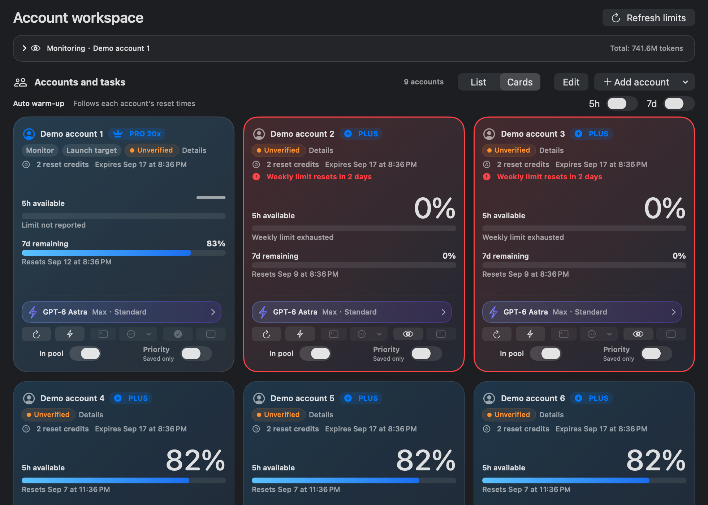
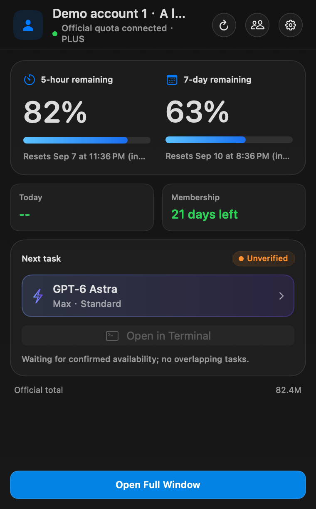
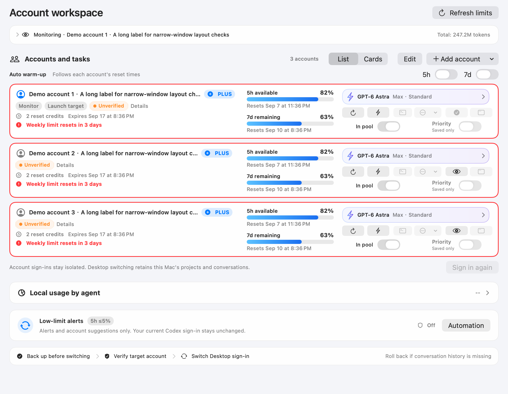
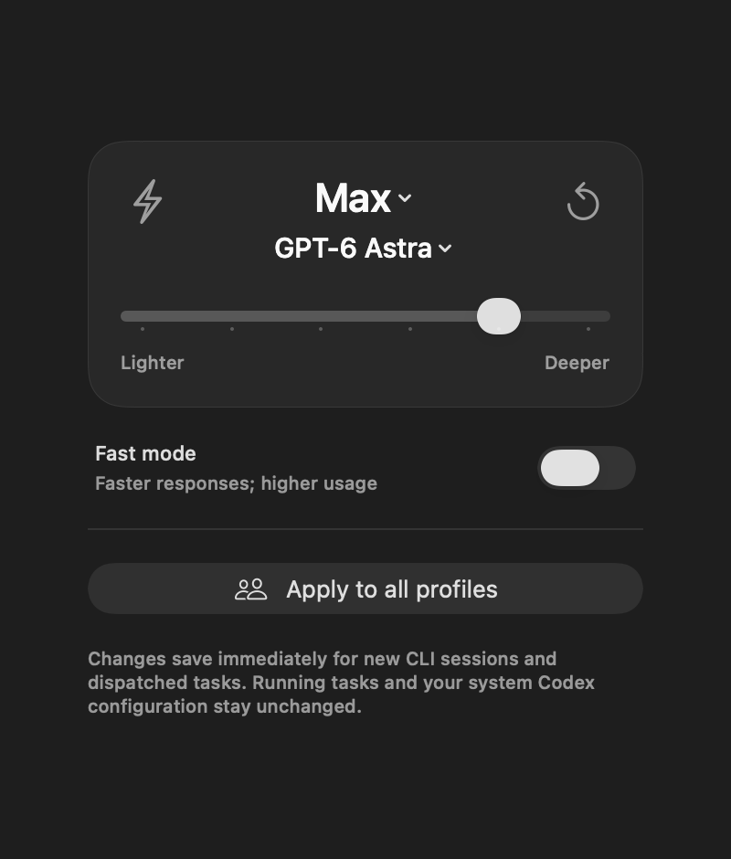
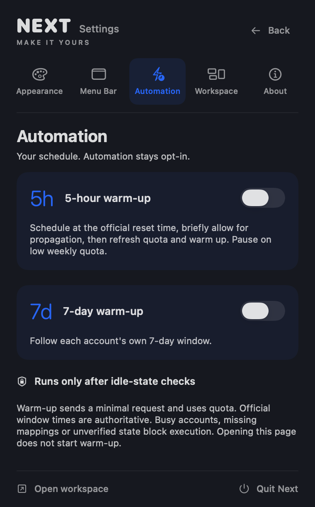

# Codex Account Manager Next

[中文](README.md) | **English**

[](https://github.com/BLACKIELF/codex-account-manager-next/actions/workflows/ci.yml)


[](LICENSE)

Next is a local-first macOS workspace for one or multiple Codex accounts, maintained under its own product identity, interface and release channel. Inspect official quota, control automatic warm-up, choose GPT-6 Astra or another task model, and pass model, reasoning effort and Standard/Fast speed to an isolated CLI. Multiple accounts retain occupancy monitoring and isolated account homes.

Current source version: `0908v6` · `9.5.11 (25)`. Local maintenance validation is complete; no installer has been released for this version. This is not an official OpenAI product. It does not provide accounts, increase quota, or bypass login, MFA, or platform restrictions.

0908v6 versus 0908v5: all seven daily maintenance and notification features now default on; new accounts continue to join dispatch by default. Explicit saved opt-outs are retained, with Enable all available in the guide. A four-step setup guide supports skipping, resuming and reopening, with separate feature, macOS permission and Feishu connection states. See the [0908v6 release notes](docs/release-notes-v9.5.11.md).

Previous version 0908v5 versus 0908v4: shows temporary maintenance pauses and preserves saved warm-up preferences, adds separate 5h and weekly alert thresholds, and provides opt-in macOS notifications. It retains the single-instance lease, shared state transactions, running-build guard and stable dispatch codes from 0908v4. See the [0908v6 consolidated notes](docs/release-notes-v9.5.11.md) for local acceptance and remaining items.

0908v3 versus 0908v2: accounts excluded from dispatch still refresh limits and subscription dates, and follow both global warm-up switches. Expired subscription dates trigger a guarded official credential refresh and recheck, with retry backoff and explicit results. Previous behavior is retained: official 5-hour and 7-day reset deadlines trigger quota reads by default, including when warm-up is off, an account is excluded from dispatch, or cached quota is exhausted. Failed reads and old exhausted windows are checked again with backoff. Fresh installations enable warm-up; upgrades preserve existing choices. Sign-in failures retain a safe error classification. This version has passed local overwrite-installation validation; see the [0908v3 notes](docs/release-notes-v9.5.8.md).

0907v3 versus 0907v2: completed English labels, action feedback, date/token formatting and notification copy. Missing 5-hour limits now use a dash with a short explanation; an exhausted weekly limit makes 5-hour availability zero in cards, the overview and menu bar without changing official data. CLI entry points share the same disabled states, and Priority explicitly says Saved only because Hub does not yet use that preference. Public screenshots now show the English native interface. This is a source-only update; see the [0907v3 notes](docs/release-notes-v9.5.7.md).

0907v2 versus 0907v1: choose List or Cards in the main window. Vertical rows remain the default, the choice persists, and the new softly tinted grid shares every account action and the same order. In Edit mode, drag the three-line handle at the top right of an account to reorder it with a short transition. List rows keep stacked quota windows, top-aligned controls, lower-left reset warnings and an icon-only terminal button; statistics expand and full account details remain accessible. Dispatch and warm-up policies are unchanged. See the [0907v2 notes](docs/release-notes-v9.5.6.md).

0907v1 versus 0905v4: a smaller workspace and account cards, a top-right full-workspace screenshot action, monotonic quota observations, and stronger current-identity, mirror-consistency and concurrent-recovery checks for dispatch synchronization. Nine-account exports have synthetic coverage. This update publishes source only, without an installer; see the [0907v1 notes](docs/release-notes-v9.5.5.md).

0905v4 improves warm-up timing after resets and adds separate opt-in Feishu notifications for quota resets and increases in available Reset credits. Deadline refreshes prioritize official quota reads, and remain pending when a refresh or account operation overlaps. Identity and idle-task checks still apply. No installer has been released for this version; see the [0905v4 notes](docs/release-notes-v9.5.4.md).

0905v3 rebuilds Settings into five direct sections: Look, Menu Bar, Automation, Workspace and About. Clickable appearance previews and segmented choices replace the long form while retaining existing preferences, account data and automation rules. See the [0905v3 notes](docs/release-notes-v9.5.3.md).

0905v2 versus 0905v1: clicking the model name or reasoning effort opens its choices directly, removing the redundant submenu in account cards, the single-account workspace and menu bar. Persistence and CLI arguments are unchanged. See the [0905v2 notes](docs/release-notes-v9.5.2.md).



> The current 0907v3 set uses the English production SwiftUI interface at native 2×. Accounts, quota and dates are synthetic; the renderer does not connect to Hub or read real credentials or Keychain. Unverified status reflects the disconnected fixture. See the [English screenshot index](docs/images/0907v3/README.md); earlier assets remain in their original folders.

## What changed in 0905v1

- Added `gpt-6-astra` with all six CLI effort levels and Standard/Fast; existing preferences remain unchanged.
- Refined the blue-purple model card, native stepped slider, model menu, Fast toggle and reset action. Apply to All appears when multiple independent accounts exist.
- Added automatic single-account focus in the workspace and menu bar: quota, task model and Terminal first, with statistics and account automation still accessible.
- Improved light/dark contrast and narrow-window cards; removed the duplicate Inspection page and merged snapshot-health notices into account cards.
- Added Astra command, persistence, bulk-apply, pricing and account-deduplication regression coverage; consolidated the pure-test runner and Swift formatting checks.
- Preserved Hub occupancy protection, warm-up, reminders, safe switching and account isolation.

See [CHANGELOG.md](CHANGELOG.md) for full history.

Using one account or several? Join the [next-version feedback discussion](docs/feedback/0905v1-discussion.md) and tell us which repeated step you would most like to remove. [0905v3 copy for X, Xiaohongshu and WeChat](docs/announcements/0905v3/README.md) includes the project URL and an Agent installation prompt. The discussion contains proposals, not shipped features or a committed roadmap.

## Feature map

| Area | Available now |
|---|---|
| Workbench | Monitored account, 5-hour/7-day quota, reset times, official lifetime tokens, local all-agent tokens, cost estimate, and full-workspace PNG export |
| Account card | Refresh, Warm Up, dispatch participation, execution preference, isolated CLI, monitoring, re-login, Chrome session, and explicit Desktop switch |
| Inline health | Hub task state, stale snapshots, failed refreshes, quota colors and dispatch participation |
| Automation Center | Low-quota account recommendations, Feishu notifications, safety gates, and recent audit events |
| Menu bar and Settings | Quota ring, density, language, theme, palettes, shortcut, always-on-top, background residency, and update checks |

The full window is a unified workspace, without a duplicate Inspection page or page-switching navigation. The Windows workspace and historical analytics models do not imply additional macOS pages.

## Full-workspace screenshots

The top-right screenshot action uses native SwiftUI/AppKit to render the current layout and expanded sections, including offscreen accounts in both List and Cards. It excludes other windows, temporary popovers and the system title bar. A system save panel writes a local PNG; nothing is uploaded and screen-recording permission is not required. The default window is 980 × 700. List rows align identity, quota and actions; the card grid adapts its column count to the window. Long remarks may truncate to one line, with full information in Details. Warnings can grow vertically and are not forcibly clipped.

Reorder handles appear only in Edit mode. Dropping within an account saves once; dropping outside the account area or pressing Escape cancels. The handle's context menu retains Move Up/Down, and Reduce Motion disables the transition. Changing layouts does not change account identity, monitoring, the launch account or dispatch participation.

Synthetic tests cover nine accounts at 820/980/1280 points in both appearances. Exports normally use 2× resolution and fall back to 1× for larger content. More than 32 million pixels or a dimension above 32768 pixels is rejected with a prompt to collapse sections, never silently cropped. This is a raster budget, not a total-process memory limit.

## Using one account



- Monitor the existing Codex login without registering a second account or changing system identity.
- Enable automatic warm-up for that one account to attempt starting the next quota window without sending a message manually each time. Five-hour and seven-day controls are independent; warm-up consumes allowance and requires the safeguards explained under [Smart warm-up](#smart-warm-up).
- To choose task models, use Set Up Isolated CLI and log the **same account** into a Next-managed environment. This does not switch Desktop identity.
- System and managed copies of the same identity count as one account. Statistics and advanced management remain accessible; redundant bulk controls are hidden.
- CLI and warm-up still require the Hub mapping and fresh state described below. Without Hub, single-account monitoring remains read-only; unknown availability never becomes an artificial idle state.



## Five common account actions with different boundaries

| Action | Purpose | Uses quota | Changes Desktop identity | Hub gate |
|---|---|---:|---:|---:|
| Refresh | Read official identity, quota, and reset time | No | No | Idle not required |
| Warm Up | Send one minimal `hi` request with that account, then refresh quota | Yes | No | Trusted mapping, fresh overview, and no active task for the alias |
| Use in Terminal | Start Codex CLI under that account's isolated `CODEX_HOME` | The task does | No | Trusted mapping, fresh overview, and no active task for the alias |
| Re-authenticate | Update the target profile's local credential through the official page | No | System profile only | Not a task-occupancy entry point |
| Switch Desktop | Replace the account currently used by the Codex app | No | **Yes** | Uses a separate safe-switch transaction |

Low-quota automation exposes no launch or switch action. It displays a candidate in-app and writes a local audit event, plus an optional masked Feishu notification when enabled. The user must return to that account card to start CLI manually, where the generic terminal entry performs its own Hub checks.

## Per-account execution preference



Each independent account stores one execution preference. A change immediately affects later CLI launches and their default subagents without editing the account's `config.toml`.

| Model | Reasoning efforts | Speed |
|---|---|---|
| `gpt-6-astra` | Low / Medium / High / XHigh / Max / Ultra | Standard / Fast |
| `gpt-5.6-sol` | Low / Medium / High / XHigh / Max / Ultra | Standard / Fast |
| `gpt-5.6-terra` | Low / Medium / High / XHigh / Max / Ultra | Standard / Fast |
| `gpt-5.6-luna` | Low / Medium / High / XHigh / Max | Standard / Fast |
| `gpt-5.5` | Low / Medium / High / XHigh | Standard / Fast |
| `gpt-5.2` | Low / Medium / High / XHigh | Standard |

The default is `gpt-5.6-sol + high + Standard`. Unsupported combinations are rejected without replacing the last valid setting. Apply to All is a one-time overwrite; accounts can still be adjusted individually afterward.

Astra CLI parameters follow the local model catalog; server-side account access still applies and there is no silent downgrade. Max and Ultra are distinct. CLI Ultra must not be confused with the public API reasoning range. Local API-equivalent estimates now use Astra's own rates, not an older model's fallback price; this is not a subscription bill. See [OpenAI's Astra documentation](https://developers.openai.com/api/docs/models/gpt-6-astra).

Propagation covers the primary model and effort, default subagent model and effort, and Standard/Fast service tier. If Hub creates work through another entry point, that dispatcher must explicitly reuse the generated command or the same parameter set; Next currently reads Hub state but does not create Hub tasks. Warm-up is a separate maintenance action fixed to lightweight `gpt-5.6-luna`; it does not reuse task execution preference.

## Hub task state and duplicate-use risk control

Next reads local Hub overview from `http://127.0.0.1:8787/api/overview` and maps tasks by account dispatch alias:

- Polling interval: 10 seconds.
- An overview older than 30 seconds is stale.
- Active phases: Awaiting Approval, Starting, Work in Progress, Requesting Cancellation, and Status Uncertain.
- Success, failure, or cancellation remains visible for about two minutes, then returns to Idle.
- If Hub is offline, returns an unknown state, lacks the account alias, or becomes stale, Next fails closed: terminal entry is disabled, and warm-up is rejected when its execution gate runs.
- Entry points reopen when a fresh overview has no active task for the trusted alias, or only a terminal state remains.

This is account occupancy coordination and status feedback, not an in-app remote task console or an atomic lease. A race remains between checking and starting, so external dispatchers must follow the same Hub occupancy protocol. Next does not take over the central identity, create Hub tasks, or silently switch the current Codex account.

### Hub integration prerequisites

Hub accounts are externally provisioned. There is no mapping editor in the app. The dispatch participation toggle matches a snapshot account home to one existing Hub account, then synchronizes participation and its code; missing or conflicting mappings block writes. External dispatchers with model allowlists must also add `gpt-6-astra` and its six effort levels. Updating Next does not deploy a separate Hub service.

Account-card dispatch codes and Hub aliases are stored here. Entries can be provisioned in advance or created by enabling dispatch participation:

```text
~/Library/Application Support/CodexAccountManagerNext/dispatch-codes-v1.json
```

```json
{
  "schemaVersion": 1,
  "accounts": [
    {
      "code": "A",
      "alias": "account-a",
      "profileId": "<managed-profile-id>"
    }
  ]
}
```

`code` must be a unique single letter from `A` through `Z`; `alias` and `profileId` must be nonempty. Enabling participation preserves an existing code or assigns the letter after the current maximum (A for an empty catalog), using the Next profile matching the Hub home. Disabling removes that account's entry. Successful synchronization immediately refreshes the code cache and account cards; external edits still require restarting Next.

The UI action updates snapshot `automaticSwitchParticipation`, the inverse Hub `config.json` flag `dispatchDisabled`, and the code catalog together. Ordinary snapshot saves, startup, and background refreshes do not invoke this synchronization. An app in `build/` resolves `agent-remote-control-0828v1/config.json` beside the Next checkout; other installation locations require an absolute `CAMNEXT_HUB_CONFIG_PATH` in the Next launch environment.

All three configurations are validated and backed up before replacement using temporary files and atomic swap/rename. After a swap, Next verifies the displaced original to detect a competing write between the final check and replacement; detected changes are preserved where possible while this transaction rolls back. Originals are retained under `dispatch-participation-backups/<transaction-id>/` in the Next application support directory, with a `manifest.json` recording whether the code file was originally absent. Each file replacement is atomic. An external writer that does not honor Next's lock still cannot receive an absolute cross-process, three-file transaction guarantee, and a process crash or power loss may prevent complete rollback. Incomplete rollback produces a redacted error and retains backups; do not edit these files manually while changing the toggle. Hub caches `dispatchDisabled` at startup and must reload configuration to adopt changes; Next does not operate the Hub process.

“Priority dispatch” currently stores a Next preference and ensures participation and code synchronization only. Hub does not yet consume `prioritizeDispatch`, so enabling it does not change Hub account selection and does not mean that Next deployed Hub-side support.

Run `python3 scripts/test-dispatch-participation.py` for full Swift source typechecking and isolated offline tests, or select `--typecheck-only` / `--tests-only`. The script interprets Swift tests with generated temporary fixtures, without building or launching Next or accessing real account configuration.

The standalone Inspection page has been removed. Next no longer reads `inspection-config-v1.json` / `CAMNEXT_INSPECTION_CONFIG`; existing local files are left untouched. Account cards still use `dispatch-codes-v1.json` and a fresh Hub overview for occupancy protection.

## Accounts and browser login

- Every independently managed account uses a Next-owned isolated `CODEX_HOME` and credential snapshot; the system profile still represents the user's active `~/.codex`.
- On first add or re-authentication, bind an existing Chrome profile or use a persistent account-specific Chrome session.
- The official page still handles login, passwords, cookies, and MFA. Next does not read or bypass them.
- Stable Account ID and masked email are verified after login to reject duplicate or mismatched identities.
- Notes, ordering, monitored-account selection, and moving local account data to Trash are supported. Removing local data does not delete the OpenAI account.
- Pro `5x/20x` is display metadata only; it cannot change the real plan or quota.
- Local reset history can be corrected manually but is never presented as an official available reset count.

## State lives on the account cards

The workspace now brings together quota, task occupancy, recent results and refresh health. Snapshots older than 30 minutes, invalid timestamps and failed refreshes receive inline notices. Quota colors and dispatch participation remain in place.

The old fixed `gpt-5.6-sol + high` configuration baseline has been removed so a deliberate Astra selection is not treated as an anomaly. Notices do not trigger login, configuration writes, warm-up or switching.

## Smart warm-up



The 5-hour and 7-day warm-up controls are independent. Missing preferences default on; upgrades preserve explicitly saved choices. Warm-up sends a real minimal request and consumes quota; either control can be turned off at any time.

Single-account users can also enable automatic warm-up; a second account is not required. Next must remain running on an awake, connected Mac, and identity, quota, Hub mapping and idle-state checks must pass. Both warm-up windows follow their global switches independently of dispatch participation. Accounts excluded from dispatch still refresh limits and subscription dates and warm up eligible windows.

### How the five-hour window relates to warm-up

Five hours is a usage window, not five hours of guaranteed continuous work. Local and cloud usage share the allowance, and weekly limits may also apply. Check the official dashboard or CLI `/status` for the account's current limits. [Official usage guidance](https://learn.chatgpt.com/docs/pricing#what-are-the-usage-limits-for-my-plan)

Next uses the server's `resetsAt` timestamp and `windowDurationMins`, not a timer restarted when you open Next or run out of quota. Remaining time is `max(0, resetsAt - now)`. [Official field definitions](https://learn.chatgpt.com/docs/app-server#6-rate-limits-chatgpt)

For illustration, if a request at 9 a.m. starts a window and the server reports a 2 p.m. reset, starting work at 11 a.m. leaves three hours until that reset. Public documentation does not guarantee “first message plus five hours” for every plan and circumstance. Warm-up attempts a minimal request after the old window ends, then reads official state again; request success alone does not prove a new window started. It consumes allowance, does not force an early reset, add quota, consume an earned reset credit, or lift weekly limits. Work-hour scheduling and daily maintenance-request caps remain proposals.

### Execution and safeguards

Execution flow:

1. Perform a quota-only refresh and verify identity plus fresh quota.
2. Resolve the alias from dispatch codes or the existing Hub account home, then confirm that the fresh Hub overview has no active task for that alias. A missing task list blocks warm-up.
3. Use a temporary, cookie-free, cache-free session against the ChatGPT Codex backend SSE endpoint.
4. Send `gpt-5.6-luna`, `store:false`, and a minimal `hi` input.
5. Refresh quota on success. On failure, record a classified result and do not retry the same idle window automatically.

The implementation uses a 45-second request timeout, 90-second resource timeout, 64 KiB response limit, 1 MiB auth-file read limit, and rejects redirects. Authentication loss, 403, 429, server errors, network failures, timeouts, oversized responses, and incomplete SSE are reported separately.

While warm-up is active, conflicting add, login, delete, switch, and manual-refresh mutations are blocked. All-account quota maintenance runs every 10 minutes while either warm-up is enabled and every 30 minutes while both are disabled. Known official reset deadlines also trigger a quota read, regardless of warm-up controls, dispatch participation or an exhausted cached quota. Failed reads or an old exhausted window still reported after its deadline are checked again at least 60 seconds apart. Failed reads retain the previous snapshot and block warm-up until fresh quota is confirmed. A 7-day remaining quota at or below 5% pauses automatic 5-hour warm-up.

The protocol implementation references [qxcnm/Codex-Manager](https://github.com/qxcnm/Codex-Manager) under MIT terms. See [THIRD_PARTY_NOTICES.txt](Resources/THIRD_PARTY_NOTICES.txt).

## Low-quota account recommendation


> This screenshot shows an older interface. Since 0908v6 the feature defaults on and can be adjusted in Getting started or Automation.

This feature defaults on and is a candidate hint based on locally saved data, not automatic dispatch or automatic account switching. Its current conditions are:

- The source account has `<= 5%` remaining in the official 5-hour window, or `< 10%` in the 7-day window.
- Source quota and the local Codex task snapshot are no more than 45 seconds old, with no running, waiting-for-input, or unconfirmed task.
- Codex has been out of the foreground for at least two minutes, and the legacy manager is not running.
- Both source and candidate participate in dispatch.
- The candidate has a saved email, Account ID, and local `auth.json`, with at least 30% remaining in every triggered window according to its saved snapshot.
- At least one hour has elapsed since the previous evaluation.

The recommendation stage does not independently re-verify candidate identity, snapshot freshness, or candidate Hub idle state, so it exposes no launch or switch action. It displays text in-app and writes a local audit event; if Feishu is enabled and configured, it also sends a masked notification. Return to the candidate's account card and select Use in Terminal manually, where that entry point performs the Hub gate. The recommendation itself does not rewrite `~/.codex/auth.json` or switch Desktop.

Alert thresholds can be set independently to 5%, 10%, 15%, 20% or 25% in Automation Center. Defaults remain 5h at or below 5%, and weekly below 10%. Candidate limits, identity/task checks and the one-hour alert interval are unchanged. Temporary maintenance overrides are shown explicitly; affected switches cannot overwrite saved preferences.

## macOS notifications

Low-limit system notifications default on. Choose Allow notifications in Getting started or Automation to request macOS permission. An enabled switch without permission is shown as Permission needed; startup never requests permission automatically. Notifications contain fixed copy and remaining percentages only, with no account details. Low-limit alerts must also be enabled. Permission denial and submission failure are visible; successful submission does not guarantee a banner because notification and Focus settings control presentation.

## Feishu notifications

Feishu and both quota-event notification options default on. Without a configured bot they show Setup needed and retain their switch preferences; sending begins only after the connection is configured.

Feishu uses only a group Custom Bot webhook:

- The webhook is stored only in macOS Keychain. It is never prefilled, written to settings, logged, or committed.
- Only official HTTPS Bot Hook paths on `open.feishu.cn` and `open.larksuite.com` are accepted. Redirects are rejected.
- Cards contain masked source/candidate accounts plus non-sensitive event metadata such as title, result, window, remaining quota, timestamp, and a random event UUID; they contain no credentials or task body.
- Notification failure never mutates local account or quota state.
- After a valid webhook is saved, an explicit Send Test click makes one external request even when automatic notifications are off.
- Automation Center keeps a bounded recent audit history without prompt or response bodies.

Never send a webhook to an AI, paste it into a terminal or Issue, or include it in a screenshot or commit.

## Safe Desktop switching

Explicit paths that can replace the current Codex login are a UI/`--switch-profile-id` Desktop switch, system-profile re-authentication, and recovery of an unfinished switch. Low-quota recommendations, warm-up, and independent-account CLI do not change Desktop identity. Desktop switching uses this transaction:

1. Verify target email and stable Account ID.
2. Acquire the Next-specific cross-process lock and check for the legacy manager.
3. Record source ownership in a private pending journal.
4. Ask Codex to quit gracefully first; after a timeout the app or a remaining shared runtime may be force-terminated, and the write is aborted if shutdown still fails.
5. Re-check that no other process changed the source credential before writing.
6. Atomically replace `~/.codex/auth.json` with restrictive permissions.
7. Verify the target identity after the write; roll back safely only when ownership still matches.
8. Reopen Codex; the normal path verifies session linkage. A user-confirmed forced switch explicitly skips restoration of the prior task session.

The legacy manager does not share Next's switch lock. Do not switch accounts in both apps concurrently; absolute zero-race behavior across applications cannot be promised.

## Personalization


Settings are grouped by purpose rather than one long mixed form.

| Section | Controls |
|---|---|
| Look | System/Light/Dark appearance previews, palettes, language, opacity and ring motion |
| Menu Bar | Live preview/reset, display style, quota direction, metrics and reset countdown |
| Automation | Independent 5-hour/7-day warm-up controls with quota and occupancy safeguards |
| Workspace | Runtime sources, statistics zone, always-on-top, background residency and shortcut |
| About | Version, current runtime, plan, update checks and open-source provenance |

The settings captures render production SwiftUI at 760 × 1220 px, native 2×, with isolated synthetic data. They do not read user credentials or start warm-up. Twenty section previews cover both languages and appearances.

- The menu-bar popover and Settings support Chinese/English; the full workspace, model editor and Automation Center are currently Chinese-only.
- System, Light, and Dark appearance.
- Built-in palettes including Default, Blue-and-White Porcelain, Forbidden City Red, A Thousand Li of Rivers and Mountains, Dunhuang, Lanshu, and Liquid Keycap, each with light/dark variants.
- Minimal, Classic, and Rich menu-bar styles with used/remaining mode, 5h, 7d, monthly, today's tokens, and reset countdown options.
- Account-popover density, animation/power-saving mode, always-on-top, background residency after close, and a configurable global shortcut.
- Respects macOS Low Power Mode, thermal state, and Reduce Motion.
- Automatic public GitHub Release checks run at most daily; users can check manually on demand. Updates are never installed silently.

## Requirements and platform scope

| Item | Requirement / status |
|---|---|
| macOS | 13.0 or later |
| Architecture | Apple Silicon and Intel |
| Codex | A working logged-in Codex app or CLI |
| Build tools | Xcode Command Line Tools, Swift, Git, and Make |
| Hub coordination | Account mappings must be externally provisioned and local Hub must provide a fresh overview at `127.0.0.1:8787`; otherwise CLI/warm-up fail closed |
| Windows | A Tauri workspace remains in the repository, but parity with current macOS account management, switching, warm-up, and Feishu features is not promised |

## Installation

The repository currently has no `0908v6 / 9.5.11` GitHub Release installer, and no Apple Developer ID-signed and notarized installer for this version. Install from a local source build on the target Mac. Do not treat an Actions artifact as a notarized distribution.

```bash
xcode-select --install
git clone https://github.com/BLACKIELF/codex-account-manager-next.git
cd codex-account-manager-next
make build
```

Building does not launch or install the app. The result is:

```text
build/CodexAccountManagerNext.app
```

First installation for the current user:

```bash
mkdir -p "$HOME/Applications"
ditto build/CodexAccountManagerNext.app "$HOME/Applications/CodexAccountManagerNext.app"
open "$HOME/Applications/CodexAccountManagerNext.app"
```

For an existing Next installation, quit that exact app, check for duplicates, retain a recoverable backup, and overwrite the same path. Do not create a second same-named copy or replace a differently named legacy manager.

You can give an Agent with local execution access this prompt:

```text
Install Codex Account Manager Next from https://github.com/BLACKIELF/codex-account-manager-next. Read the README and check system requirements and existing installations first. If Next is already installed, back it up and upgrade in place without creating a duplicate. Preserve account data and the current Codex login. Verify the installed version and launch. Ask me when permissions, dependencies or official login are needed; do not bypass security checks.
```

Local builds use an ad-hoc signature, which is not Apple notarization. Verify structural integrity with:

```bash
codesign --verify --deep --strict build/CodexAccountManagerNext.app
```

## First-time setup

1. Make sure official Codex is already logged into one working account.
2. Open Next and select Add Account.
3. Choose account-specific Chrome or bind an existing Chrome profile, then finish the official login flow.
4. Wait for identity and quota verification, then set a note. If the local Hub has a dispatch mapping, its code appears automatically.
5. Choose model, reasoning effort, and Standard/Fast per account; use Apply to All only when desired.
6. Confirm Hub is online and the account reports Idle before using Use in Terminal.
7. Use Switch Desktop only when you intentionally want to replace the Codex app's current login.
8. Getting started has four steps: workspace, features, alerts and completion. Skip, resume or reopen it anytime. Both warm-up controls, low-limit alerts, system notifications, Feishu notifications, limit-reset alerts and new-credit alerts default on. Notifications require system permission or a configured Feishu bot.

## Updating and uninstalling

Quit the running Next and retain a recovery backup before updating the retained source checkout:

```bash
git pull --ff-only
make build
```

Overwrite the existing installation with the new build, then open it and confirm that only one Next instance is running. An upgrade preserves warm-up preferences and does not automatically enable low-quota automation, Feishu, or Desktop switching.

To uninstall the app, move `CodexAccountManagerNext.app` to Trash. Remove Next's isolated data only after confirming that saved accounts, settings, and Keychain items are no longer needed; deleting the app bundle alone preserves them.

## Isolation from the legacy app

| Item | Next namespace |
|---|---|
| Bundle ID | `com.blackielf.codex-account-manager-next` |
| Executable | `CodexAccountManagerNext` |
| Saved profiles | `~/.codex-account-manager-next/profiles/` |
| Application Support | `~/Library/Application Support/CodexAccountManagerNext/` |
| Cache | `~/Library/Caches/CodexAccountManagerNext/` |

Bundle, executable, profiles, Application Support, cache, defaults, shortcut, update source, logs, and temporary files all use Next-specific namespaces. The only critical shared object is Codex's active `~/.codex/auth.json`; an explicit Desktop switch, system-profile re-authentication, or unfinished-switch recovery may write it through a verified transaction.

## Privacy and network boundaries

- Tokens, webhooks, raw account email, and prompt/response bodies are not written to app UI, default logs, test fixtures, documentation screenshots, or commits. Diagnostic JSON and analytics UI hide known full project/Skill paths. An explicitly copied/launched CLI command expresses the isolated `CODEX_HOME` through `$HOME`, but a working directory deliberately chosen by the user still has to be passed to their own shell.
- Local analytics and session caches may retain source paths for projects, Skills, and rollouts so records can be merged; the app does not upload those caches. Do not attach them to a diagnostic report, and continue removing private paths from any logs you share.
- If an existing state file cannot be decoded safely, mutation fails closed instead of overwriting it with blank data.
- Official identity and quota can be read through local Codex CLI / `codex app-server`; per-account refresh also uses that account's local access token to request the official `chatgpt.com/backend-api/wham/profiles/me` endpoint directly.
- Warm-up first reads local Hub state and refreshes quota through local `codex app-server` before the request, then refreshes again after a successful request. Its direct external minimal request goes only to the ChatGPT Codex backend endpoint.
- The updater reads only public GitHub Release metadata from this repository.
- Automatic Feishu notifications require a saved allowlisted webhook and the enabled toggle. Manual Send Test requires only a saved webhook and makes an external request immediately after the click.
- Local Hub state is read only over loopback.
- The project cannot promise zero enforcement risk, zero rate limiting, or permanent third-party compatibility.

See [SECURITY.md](SECURITY.md) for the complete boundary.

## FAQ

### Why is Use in Terminal disabled?

Next lacks a Hub overview newer than 30 seconds, the account mapping is missing, Hub returned an unknown state, or the account already has active work. Complete the external mapping under Hub integration prerequisites, start local Hub, wait for the next 10-second poll, and confirm that the account returns to Idle.

### Why did warm-up not run?

Check the opt-in switch, identity, quota freshness, Hub idle state, and weekly quota. A failed idle window is not retried automatically; a new valid quota window allows reevaluation.

### Why does Google/OpenAI ask me to log in again?

First add, expired official session, password change, or security verification can require a new login. Bind the correct Chrome profile or use account-specific Chrome. Next does not read passwords, cookies, or MFA.

### Why was no low-quota account recommended?

Threshold, source quota/task freshness, foreground-idle, legacy-process, dispatch participation, saved candidate quota, and the one-hour evaluation interval must all pass. The hint does not check candidate Hub idle state; Use in Terminal performs that gate when launched. Some failed prerequisites return silently; an Automation Center audit event is written only after a recommendation is formed.

### Why did Feishu fail?

Confirm a complete official Custom Bot webhook, that the bot is still in the group, and that the allowlist matches. Save it again and click Test only when willing to send a real message. Never post the URL to an Issue or chat.

### Where are the old Trends, Projects, Skills, and Leadership pages?

0905v1 focuses on one workspace. The duplicate Inspection page and unmounted legacy views have been removed. Underlying analytics models still support current totals and menu-bar data; unavailable pages are not advertised as current features.

## Development and verification

Core pure-local checks:

```bash
make build
make test-profile-store
make test-account-inspection
make test-automatic-account-switch
make test-account-switch-safety
make test-feishu-webhook
make test-account-automation-audit
make test-app-server-pipe
make test-token-counter
make test-macos-compatibility
build/CodexAccountManagerNext.app/Contents/MacOS/CodexAccountManagerNext --self-test-warm-up-policy
make memory-risk-check
codesign --verify --deep --strict build/CodexAccountManagerNext.app
git diff --check
```

`make run`, `make probe`, `make install`, real login, real warm-up, real account switching, and real Feishu sends touch local or external state and require an explicit user action in a trusted environment. Pure tests do not prove those live behaviors were exercised.

## Version and license

- Version name: `0907v1`
- Marketing version: `9.5.5`
- Build: `17`
- Product design: [docs/DESIGN_SYSTEM.md](docs/DESIGN_SYSTEM.md)
- Architecture and boundaries: [BLUEPRINT.md](BLUEPRINT.md)
- Security boundary: [SECURITY.md](SECURITY.md)
- Full history: [CHANGELOG.md](CHANGELOG.md)
- License: [MIT](LICENSE)
- Third-party code and resource notices: [THIRD_PARTY_NOTICES.txt](Resources/THIRD_PARTY_NOTICES.txt). Independent branding does not remove applicable copyright or license requirements.

Reproducible reports are welcome through [Issues](https://github.com/BLACKIELF/codex-account-manager-next/issues). Before posting, remove account email, tokens, webhooks, task bodies, private paths from logs, and personal details from screenshots.
