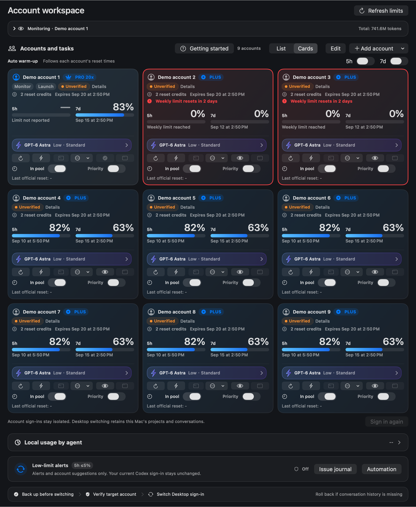
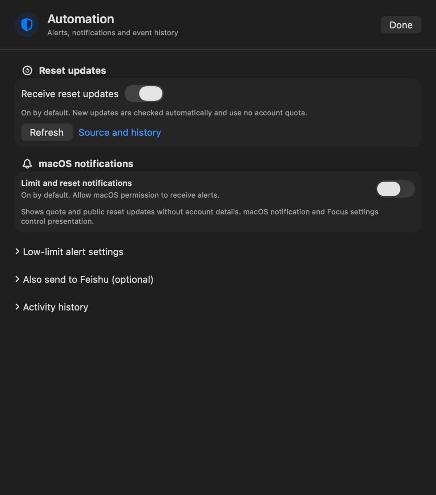

# AiGoodBro · AgentHub

**AiGoodBro** is a native macOS workspace for multiple Codex accounts, with **AgentHub** as its Home view. Check quota, receive reset announcements, switch accounts from one place, and dispatch isolated CLI tasks to other accounts. Upgrades preserve existing accounts and settings.

[中文](README.md) | **English**


Before starting work, answer four questions: how much quota remains, when it resets, whether the account is usable now, and how far the task has progressed.

AiGoodBro puts quota alerts and reset news first, so you can see when work can continue and choose the account to use.

| What you need | What AiGoodBro provides |
|---|---|
| Check remaining quota | Officially returned windows, including five-hour and weekly limits, with remaining percentages, reset times and snapshot timestamps. Alert thresholds are adjustable; unknown values stay “—”. |
| Hear about resets | Public announcements from [Codex Resets](https://codex-resets.com/), distinguishing regular resets from banked reset credits, with event times and original-source links. Account-specific reset countdowns remain separate. |
| Receive notifications | Native macOS notifications, optional Feishu alerts, and configurable Telegram / WeCom group bots. Permissions, configuration and supported event types apply to each channel; see below. |
| Switch accounts | Start a Desktop switch from an account card and follow preparation, graceful exit, write, relaunch and verification. Isolated CLIs can use other accounts independently. |
| Continue after low quota | The published source provides alerts and account recommendations. Automatic execution wiring is being repaired and validated and is not yet a completed feature. The candidate automatic path requires opt-in, Codex to have exited and safe task state. |
| Coordinate and troubleshoot | Per-account CLI environments and model preferences, reservations before launch, task states, execution receipts and operational issue logs. |

A single account can use read-only monitoring. A public announcement, an account's recovered quota and its available reset credits are separate facts: an announcement neither spends a credit nor replaces an account refresh. The WeChat integration is a **WeCom group bot**; personal WeChat is not connected.

**Current source preview: 0911v3 · 9.5.21 (35).** Build and install using the prompt below. This version has no binary Release yet; provider coverage is described below. [Candidate changes and validation boundaries](docs/release-notes-v9.5.21.md)

An installation prompt and four practical task prompts are below. Version 9.5.21 has not been published to GitHub Releases; build it from source for now.

[](https://github.com/BLACKIELF/AgentHub-AiGoodBro/actions/workflows/ci.yml)

[](LICENSE)

## Install it with your local agent

```text
Install or upgrade AiGoodBro from https://github.com/BLACKIELF/AgentHub-AiGoodBro. Read the README and check the system, dependencies and existing installation first. Record current settings, wait for the app's own operations to finish, move the old build to a dedicated rollback folder, then migrate to one AiGoodBro.app. Preserve accounts, dispatch participation, execution preferences and the current Codex sign-in. Verify the app name, running version and restored settings. Do not leave two launchable copies, terminate other CLI tasks, start real tasks, switch accounts or send notifications just to test the installation. Let me complete any official sign-in manually.
```

Requires macOS 13+, a working Codex sign-in and Xcode Command Line Tools. A single account can start with read-only monitoring. CLI launch and warm-up also require a configured local Hub and account mapping; those controls remain blocked when required evidence is missing. Setup checks existing Python 3.9+ and Codex CLI and can prepare the companion Skill. External Python and Codex are not bundled. Companion Hub setup requires a selected project and accounts and preserves existing services.

To build yourself:

```sh
git clone https://github.com/BLACKIELF/AgentHub-AiGoodBro.git
cd AgentHub-AiGoodBro
make build
```

The build result should be `build/AiGoodBro.app`. Building does not install or launch it. Back up the old build, then migrate to one `AiGoodBro.app` without leaving a second launchable copy. See the [compatibility map](docs/brand-compat-0911v1.md). Local builds use ad-hoc signing; no Apple-notarized 9.5.21 download has been published.

Future installer assets should use `AiGoodBro-<version>-mac-<arch>.dmg`. No 9.5.21 installer is currently available.

## Start with the workspace

Choose **Professional** or **Simple** at the top of Home. Professional starts with the full interface expanded. Simple offers Overview, Account cards, or Custom with four optional modules. These preferences affect presentation only; provider tabs retain their full controls. Overview preserves per-account status and shows “—” for unavailable quota.



See remaining 5-hour and weekly quota alongside reported reset times. A missing window shows “—”; the workspace preserves the limits actually returned by the official source. Switch between a compact list and cards without changing account order or behavior.

Home now lists accounts across providers in one sequence. Pin one account first; accounts with freshly verified reset cards expiring within 72 hours follow it and receive a red border. Cards and rows share that order. Grok card details remain unknown when the official response provides no card fields.

Refresh each account, set its model and open an isolated CLI environment. Saved preferences apply to subsequent tasks. New accounts default to **GPT-6 Astra / Low / Standard**; actual availability depends on the account and provider.

> Workspace screenshots are retained native renders of the 0910v1 production SwiftUI views using synthetic accounts, quota and dates. “Unverified” means that the demo is not connected to a Hub. The English header illustration is retained from 0909v4. [Image provenance and prompts](docs/images/0910v1/README.md)

> Images may show an earlier layout and are included only to introduce the interface. This update adds no images.

## Choose a CLI, preset and message fields

The workspace can show installed Codex, Grok, Kimi Code, Claude Code, OpenCode, Gemini CLI, MiMo and ZCode environments. Link existing signed-in directories, name them and refresh their individual quota. See the [coverage table](docs/local-cli-accounts.md); native MiMo and ZCode subscription quota is not connected yet.

Three presets start with the saved model, Sol High with Luna Max children, and Luna Max directly. Names, main model, reasoning effort and child configuration are editable. Launches validate the effective settings and keep configuration separate from observed execution.

Feishu fields include the account label, quota, reset times, card count and nearest or all expiries. Agent name and reported balance are optional. The primary balance rounds to a whole number, with “≈” when rounded. Its details retain the exact reported value, source and time without inventing a currency or conversion.

The selected account exposes a reset-card button with three confirmations, fresh account/card checks and shared activity protection. **The reset flow was not executed or tested.** Unknown outcomes preserve the original attempt and never trigger an automatic retry. See the [implementation boundary](docs/reset-credit-control.md).

Telegram and WeCom can be configured separately in Automation Center and default to off. Codex completion alerts require an observed running-to-completed transition; archived and initial historical snapshots do not trigger them. Credentials use AiGoodBro's isolated Keychain namespace. Offline tests do not prove delivery. [Channel details](docs/message-channels-0911v1.md)


## Stop watching the reset countdown

Five-hour and weekly warm-up have separate switches. AiGoodBro refreshes official quota first, checks identity and occupancy, then sends one minimal request when the checks pass.

AiGoodBro must remain running on an awake, connected Mac. Warm-up consumes quota. Busy accounts, exhausted weekly quota or uncertain state defer the attempt; failures are rechecked after a delay. A successful request followed by 100% remaining quota no longer causes repeated warm-up every minute.

Dispatch participation only controls new task eligibility. Excluded accounts still refresh and follow the global warm-up switches. Warm-up does not add quota or redeem reset credits.

## Reserve before starting

With the companion coordination protocol, a new call reserves its account and real project directory before environment checks and process launch. Other cooperating calls can read that reservation immediately; AiGoodBro refreshes its view roughly every ten seconds.

| State | Meaning |
|---|---|
| Online · preparing | Reserved; execution has not been proven |
| Online · running | Actual process or Hub execution evidence exists |
| Online · maintenance | Warm-up or an authorized maintenance reservation |
| Ended · awaiting acceptance | The process ended; its output still needs review |
| Unverified | Evidence is incomplete and occupancy remains blocked |

Concurrent reservations for the same account or real project directory are rejected. An expired heartbeat does not make an account idle. Observations, fixes and verification are appended with dates to one issue journal, accessible from the workspace.

AiGoodBro's Terminal button registers occupancy and waits for a private launch receipt. Exit code zero only means that the session ended. The companion Hub checks shared occupancy when creating and approving tasks; older CLI entry points and older Hub builds still require process checks. AiGoodBro does not adopt those sessions. [Protocol and integration requirements](docs/dispatch-coordination.md)

## Receive public reset announcements

“Receive reset updates” is on by default. While AiGoodBro is running, it checks [Codex Resets](https://codex-resets.com/) every five minutes without consuming account quota, choosing an account or configuring Feishu. The first check establishes a baseline without sending old announcements. Later updates use macOS notifications, subject to system permission.

“Reset updates” is the first section in the workspace's Automation center. Read the latest update there even without notification permission. Expand “Also send to Feishu (optional)” only if you want that delivery channel. Upgrades preserve an existing off setting.

Cards show 5-hour and 7-day limits side by side, with three columns available at the 820-point minimum window width. Common actions stay below the limits; detailed warm-up and reset records remain in Details.

Feishu uses the pool code and account label. Connection tests, manual switches, restart tests and automatic low-limit events carry distinct reasons; low-limit alerts show only the condition that was actually met.

Connect Feishu directly in Getting started. For a saved bot, choose Authorize connection when permission is needed. Enter your login password only in the macOS dialog; choose Always Allow, if offered, to remember access. Background checks stay silent. A replaced local ad-hoc build may need authorization again.



This is a third-party public feed. An announcement does not prove that your account has reset and does not redeem a reset credit. Verify quota and available credits through the official account refresh.

The clock beside dispatch participation sets allowed or excluded times, weekdays and an IANA time zone, including intervals across midnight. It only controls new tasks; refresh and warm-up keep their own switches. The companion Skill enforces these windows. Equivalent Hub API protection requires the matching Hub build.

## Follow Desktop switch progress

The Desktop switch button immediately shows preparation progress. You can cancel while waiting for an existing refresh. Identity and quota checks run concurrently in the background, followed by visible closing, switching, opening and verification stages. Both identities remain reserved for maintenance throughout the transaction.

Changing the actual identity still requires Codex to exit and reopen. Network and process state affect the duration. An ordinary switch does not silently force termination after a timeout; forced switching requires the explicit warning. Finish active work before changing accounts.

## Four prompts to use after setup

Give these to an agent with the necessary local tools and configuration. They are not a built-in chat interface in AiGoodBro.

**1. Check before work**

```text
Read AiGoodBro's current 5-hour and weekly remaining quota, reset times in my time zone, task occupancy and execution preferences. Distinguish fresh evidence, old snapshots and unknown state. Do not start a task.
```

**2. Use a specific account**

```text
Use account A for the currently authorized task. Verify the required tools, project directory and identity; reserve the account as soon as preparation starts, then refresh quota and check occupancy. Use AiGoodBro's saved execution preferences and do not silently substitute another account. Collect and validate the output as soon as execution ends, then release the reservation.
```

**3. Diagnose missing warm-up**

```text
Check AiGoodBro's warm-up switches, recent success and failure records, official reset times, weekly quota and occupancy. Append the findings with today's date to the same issue journal. Start with the smallest diagnostic check instead of repeatedly sending real warm-up requests.
```

**4. Restore settings after an upgrade**

```text
Record AiGoodBro's settings, account order, participation and model preferences before upgrading. Wait for existing calls to finish, reserve the accounts for maintenance, back up the old build and migrate to one AiGoodBro.app. Verify the name and version, restore settings and admission controls, and release all maintenance reservations. Do not start test tasks.
```

## Defaults for a new installation

| Setting | Default |
|---|---|
| Language, layout, appearance | Chinese, list, system appearance, standard palette |
| Menu bar | Classic, weekly remaining quota, no reset countdown |
| Shortcut | ⌘U |
| New account execution | GPT-6 Astra / Low / Standard |
| Window maintenance | Five-hour and weekly warm-up enabled |
| Alerts | Reset updates, low quota, local notifications, Feishu and both quota event options enabled |
| Low quota thresholds | 5-hour ≤5%; weekly <10%, independently adjustable |

Saved choices take precedence, including disabled features. New users still receive onboarding. Local notifications require macOS authorization; Feishu requires a configured robot. An enabled switch does not prove delivery. New accounts participate in dispatch by default; existing participation choices are preserved.

## What changed

0910v1 enables local reset updates by default, with optional Feishu forwarding, and moves Desktop switching into the background with visible stage progress. It fixes Terminal executable and directory selection, adds private launch receipts and dispatch schedules, and preserves warm-up history. Sign-in reservations remain occupied until the login child process has actually stopped.

Version 9.5.21 is a source preview. The [candidate notes](docs/release-notes-v9.5.21.md) list the offline checks actually run in this round and the remaining runtime boundaries. A full official reset cycle, multi-CLI sign-in and real calls, Desktop switching, and notification delivery require separate evidence.

The existing packaging flow adds `Companion Skill/multi-agent-management` and Chinese instructions to both Mac installers. Version 9.5.21 has not been packaged, so this must be confirmed by the release wrapper. Compare and back up an existing Skill, preserving personal configuration. Installing the Skill does not configure a Hub.

[9.5.21 candidate notes](docs/release-notes-v9.5.21.md) · [Changelog](CHANGELOG.md) · [Dispatch Skill instructions (Chinese)](.agents/skills/multi-agent-management/使用说明.md) · [Detailed guide (Chinese)](docs/usage-guide.md)

## The rest of the workspace

Single-account menus, full PNG exports, labels and ordering, model and reasoning selection, Standard/Fast, apply-to-all preferences, isolated Chrome sign-in, explicit Desktop switching, low-quota suggestions, Feishu alerts, palettes and workspace settings remain available.

AiGoodBro is an independent third-party open-source project. It does not supply accounts or increase quota. An isolated CLI leaves the current Desktop sign-in unchanged; explicit Desktop switching uses a separate identity transaction. Webhooks are stored in an isolated Keychain namespace. Remove credentials, account details, task content and private paths before sharing diagnostics.

Development checks:

```sh
make build
scripts/run-self-tests.sh --skip-build --build-dir build
python3 tests/test_dispatch_activity.py
python3 tests/test-dispatch-activity-interop.py
make test-macos-compatibility
make memory-risk-check
git diff --check
```

This update targets macOS. Windows sources remain in the repository and were not validated for this version.

[Report an issue](https://github.com/BLACKIELF/AgentHub-AiGoodBro/issues) · [Security](SECURITY.md) · [Brand compatibility](docs/brand-compat-0911v1.md) · [Design](docs/DESIGN_SYSTEM.md) · [MIT license](LICENSE) · [Third-party notices](Resources/THIRD_PARTY_NOTICES.txt)
