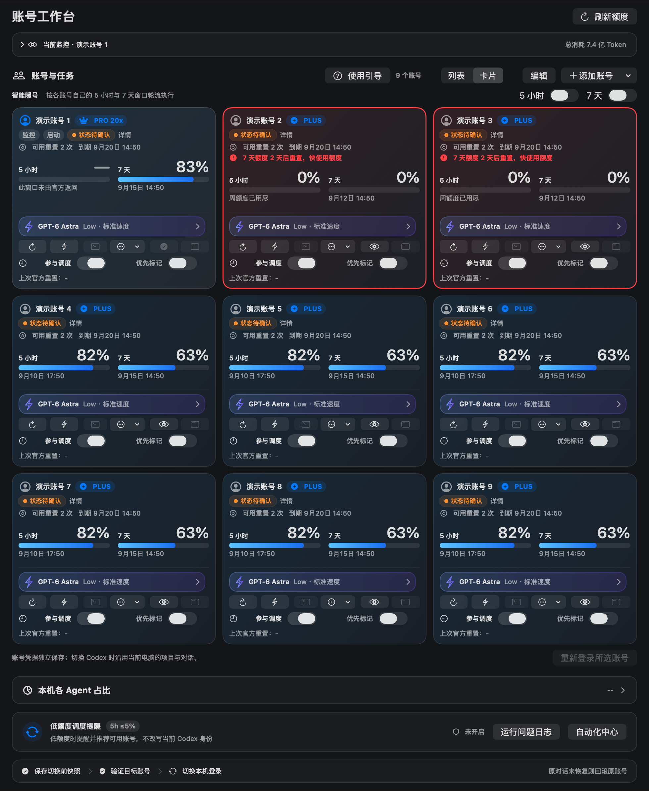
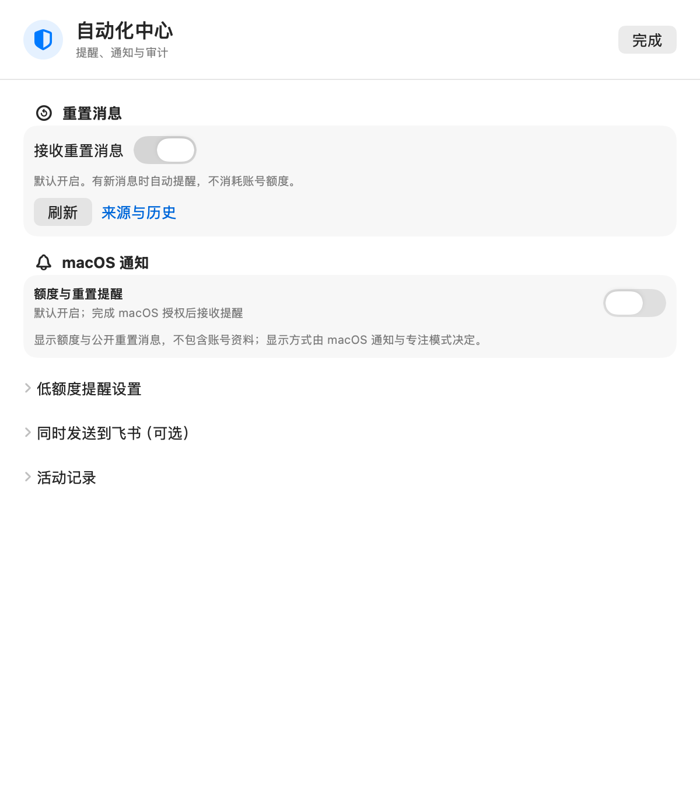

# AiGoodBro · AgentHub

原 **Codex Account Manager Next**，现更名为 **AiGoodBro**，主页工作台为 **AgentHub**。升级保留已有账号与设置。

**中文** | [English](README.en.md)


每天开工前，先回答四个问题：还剩多少额度、几点恢复、这个账号现在能不能用、任务进行到哪一步。

AiGoodBro 把额度、官方重置时间、账号可用性和任务进展放进一张原生 macOS 工作台。单账号可以只读查看，多账号可以分别保存隔离的 CLI 环境与执行偏好。

**当前源码预览：0911v1 · 9.5.19 (33)。** 可按下方口令从源码构建和安装；本版尚无 Release 安装包，多 CLI 的支持范围见下方说明。[候选改动与验证边界](docs/release-notes-v9.5.19.md)

一句话安装口令和 4 个调用模板都在下面。9.5.19 尚未发布到 GitHub Releases；源码构建或本地候选包都不代表公开下载已经发布。

[](https://github.com/BLACKIELF/AgentHub-AiGoodBro/actions/workflows/ci.yml)

[](LICENSE)

## 先装好，少做几次重复操作

把下面整段发给有本机执行能力的 Agent：

```text
请从 https://github.com/BLACKIELF/AgentHub-AiGoodBro 安装或升级 AiGoodBro（原 Codex Account Manager Next）。先读 README，检查系统、依赖和现有 CodexAccountManagerNext.app；记录当前设置，等待应用自己的操作结束，备份后在原路径覆盖，不改名或新增第二份 App。保留账号、调度参与状态、模型偏好和当前 Codex 登录，安装后逐项核对设置与实际运行版本。不要终止其他 CLI 任务，也不要为验证而启动真实任务、切号或发送通知。需要官方登录时由我手动完成。
```

需要 macOS 13+、已正常登录的 Codex，以及 Xcode Command Line Tools。只有一个账号也能先用只读监控。CLI 与暖号还需要配置本机 Hub 和账号映射；没有配置时，相关入口保持关闭并提示原因。首次引导会检查现有 Python 3.9+ 和 Codex CLI，按需准备配套 Skill；依赖由用户安装，Next 不内置外部 Python 或 Codex。配套 Hub 在确认项目和账号后单独设置，已存在的服务会保留。

自己构建：

```sh
git clone https://github.com/BLACKIELF/AgentHub-AiGoodBro.git
cd AgentHub-AiGoodBro
make build
```

应用仍位于 `build/CodexAccountManagerNext.app`，Finder 中显示 AiGoodBro。构建不会自动安装或启动；已有版本先备份，再在原位置替换，不要改成 `AiGoodBro.app`。详见[安装与配置](docs/usage-guide.md#安装与配置)与[品牌兼容表](docs/brand-compat-0911v1.md)。本机构建使用 ad-hoc 签名；9.5.19 没有已发布的 Apple 公证下载包。

后续若发布，兼容资产名仍为 `CodexAccountManagerNext-9.5.19-mac-arm64.dmg` 与 `CodexAccountManagerNext-9.5.19-mac-x86_64.dmg`；当前没有可下载的 9.5.19 安装包。

## 打开后，先看这张工作台

主页顶部可选择**专业**或**极简**。专业模式默认展开功能与各平台；极简提供总览、账号卡片、自定义三种内容，最多四个模块开关。显示方式只影响界面，各平台的完整操作仍可从顶部进入。总览按账号显示真实状态，未读到的额度保留“—”。



卡片以紧凑双栏并排显示 5 小时和 7 天额度；820 点窄窗也能横向放下三张，常用按钮集中在底部，详细暖号记录放在“详情”。官方重置时间仍在额度下方。官方未返回的窗口通常显示“—”；已确认 Pro 且未返回通用 5 小时窗口时显示“∞”，一旦官方返回有限窗口就优先显示实际额度。切换成列表可以连续查看更多账号；卡片适合横向比较，账号顺序与操作保持一致。

每个账号都能单独刷新、设模型、打开独立 CLI。执行偏好会传给后续任务，已有任务继续使用启动时的参数。新账号默认 **GPT-6 Astra / Low / 标准速度**；模型是否可用仍由目标账号和服务端决定。

> 以下界面图保留自 0910v1，由当时的生产 SwiftUI 组件原生渲染，使用演示账号、额度和日期，不读取个人凭据。图中的“状态待确认”表示未连接 Hub。[图片来源与制作提示词](docs/images/0910v1/README.md)

## 选择 CLI、执行档位和消息内容

工作台顶部可选择本机已安装的 Codex、Grok、Kimi Code、Claude Code、OpenCode、Gemini CLI、MiMo 和 ZCode。每个 CLI 可关联已有登录目录，分别命名和刷新；支持范围见[账号与额度说明](docs/local-cli-accounts.md)。MiMo 与 ZCode 原生订阅的额度暂未接通，界面会明确提示。

模型菜单提供三个可改名称和组合的档位：沿用当前模型、Sol High 配 Luna Max 子代理、Luna Max 直接执行。每档均可更改主模型、强度和子代理配置；启动前校验最终参数。配置显示与实际执行证据分别记录。

飞书设置可选择账号备注、额度、重置时间、重置卡数量及最近或全部到期时间；Agent 名称和官方余额可选。默认省去长编号。主界面余额四舍五入为整数，发生取整时显示“≈”；点击说明可看精确原值、来源与时间。接口未提供币种和换算时不标为美元。

选中账号后可看到“使用重置卡”。此入口仅供用户手动操作，Agent 不得主动使用。它要求三次明确确认，发送前重新核对账号、卡片、期限和占用。**本次没有执行或测试重置流程**；未确认结果会保留原尝试，禁止自动重试。详见[实现和验证边界](docs/reset-credit-control.md)。

## 不用守着倒计时等暖号

5 小时与 7 天暖号分别设置。Next 到时先刷新官方额度，再核实账号身份和占用，条件满足才发送一次最小请求，尝试开启下一轮窗口。

需要 AiGoodBro 持续运行、电脑唤醒并联网。暖号会消耗少量额度；账号忙碌、任一已知订阅窗口用尽或状态不明时会等待复核。有额外余额也不会因此继续暖号。到重置时间先只读刷新，确认额度恢复后再继续；普通失败按间隔重试。成功后即使额度仍显示 100%，也不会因此每分钟重复暖号。

“参与调度”只决定能否接新任务。关闭后仍能刷新额度、检查会员日期，并按全局开关维护窗口。暖号不增加额度，也不使用重置券。

## 准备调用时，就让其他任务知道

通过配套调度协议调用时，先预约账号和工作目录，再做环境检查和启动。其他遵守协议的调用可以立即读到占用，Next 界面约每 10 秒更新。

| 你看到的状态 | 含义 |
|---|---|
| 在线·准备中 | 已占位，尚未证明真实执行 |
| 在线·运行中 | 有真实进程或 Hub 运行证据 |
| 在线·维护中 | 暖号或经过授权的维护占位 |
| 已结束·待验收 | 进程已结束，成果还要检查 |
| 状态待确认 | 信息不足，继续保留占用 |

同账号或同一真实项目目录的并发预约会被拒绝。心跳超时不会直接当成空闲。问题按日期追加到同一个日志，后续修复与验证接着记录；工作台有“运行问题日志”入口。

AiGoodBro 的终端按钮会登记占用并等待启动回执；退出码 0 只表示会话结束。配套新版 Hub 在创建和批准时检查共享占用；旧 CLI 和旧 Hub 仍需检查实际进程。AiGoodBro 不会接管旧入口。[协议、接入条件与日志](docs/dispatch-coordination.md)

## 重置消息来了，先收到提醒再核对账号

“接收重置消息”默认开启。Next 运行时每 5 分钟查询 [Codex Resets](https://codex-resets.com/) 的公开记录，不消耗账号额度，也不用选择账号或配置飞书。首次检查记住已有记录，不补发历史消息；后续新消息使用 macOS 通知，需在系统中允许 Next 通知。

工作台底部“自动化中心”的第一项就是“重置消息”，可以看最新内容、刷新或关闭。没有通知权限时，消息仍可在这里查看。需要转发到飞书，再展开“同时发送到飞书（可选）”。升级保留已有关闭选择。

飞书消息使用调度编号与账号备注。连接测试、手动切换、测试重启和低额度事件分别标明原因；低额度提醒只列实际达到的条件。

飞书可在“使用引导”直接保存并连接。已有机器人需要权限时点击“授权连接”，只在 macOS 系统弹窗中输入登录密码；可选择“始终允许”记住授权。后台检查不弹密码框。本地 ad-hoc 构建更换后可能需要重新授权一次。



这是第三方汇总的公开消息，不能证明你的账号已经重置，也不会自动使用重置卡。账号可用额度和重置卡数量仍以官方刷新结果为准。

“参与调度”旁的时钟可设置允许派单的时段、星期和时区，也支持跨午夜。时段只限制新任务，刷新和暖号继续按自己的开关执行。配套 Skill 会检查时段；Hub API 的同等保护需要部署匹配的 Hub 版本。

## 切换时，知道正在做什么

点击“切换 Desktop”后立即显示准备状态；等待已有刷新结束时可以取消。身份和额度检查在后台并行完成，之后显示退出、切换、打开和验证进度。来源与目标账号同时保留维护占用，避免另一项任务抢先使用。

真正换号仍需安全退出并重新打开 Codex，耗时取决于网络及进程状态。普通切换不会超时后悄悄强退；需要强制切换时会明确提示。请先结束正在进行的工作，再进行真实账号切换。

## 装好后，挑一个真实场景

这些口令交给能操作本机、且已配置相应工具的 Agent；它们不是 Next 内置的聊天指令。

**① 开工前看一眼**

```text
检查 Next 当前账号的 5 小时和 7 天剩余额度、上海时区重置时间、任务占用与模型偏好。先只读检查，区分新鲜数据、旧快照和未知状态。
```

**② 用指定账号做事**

```text
用账号 A 完成当前已授权任务。先核对目标环境所需工具、工作目录和账号身份，准备调用时立即占位，再刷新额度并验证占用。使用 Next 保存的执行偏好；不可用时不要静默换号。实际结束后及时读取成果、验收并释放占用。
```

**③ 排查暖号没有执行**

```text
检查 Next 的暖号开关、最近成功和失败记录、官方重置时间、周额度及账号占用。把本次发现按日期追加到同一运行问题日志，先给出最小验证，不通过真实请求反复试错。
```

**④ 升级后恢复原状**

```text
升级 Next 前保存当前设置、账号顺序、参与状态和模型偏好。先等待已有调用结束，再做维护占位和原位覆盖。完成后核对版本、恢复原设置、恢复接单开关并释放占位，不启动测试任务。
```

## 新用户打开后的默认设置

| 设置 | 默认值 |
|---|---|
| 语言、布局、外观 | 中文、列表、跟随系统、默认配色 |
| 菜单栏 | Classic，显示 7 天剩余额度，不显示重置倒计时 |
| 快捷键 | ⌘U |
| 新账号任务参数 | GPT-6 Astra / Low / 标准速度 |
| 窗口维护 | 5 小时与 7 天暖号开启 |
| 提醒 | 重置消息、低额度、系统通知、飞书及两类额度事件开启 |
| 低额度提醒线 | 5 小时 ≤5%，7 天 <10%，可分别调整 |

已有设置优先，升级不会重新覆盖你保存的关闭选择。新用户仍会看到使用引导；系统通知要先获得 macOS 授权，飞书要先配置机器人，开关开启不等于已经送达。每个新账号默认参与调度，现有账号的参与选择保留。

## 这次具体修了什么

0910v1 的既有改动：重置消息默认通过本机提醒，飞书成为可选转发；Desktop 切换改为后台执行和阶段反馈。修复终端启动路径、工作目录与启动状态误报，增加私有回执、参与时段和登录维护占用，保留暖号成功与失败历史。登录子进程未确认退出时继续保留占用。

9.5.19 为源码预览；本轮实际完成的离线验证与未验证边界以[候选记录](docs/release-notes-v9.5.19.md)为准。完整官方重置周期、多 CLI 登录与真实调用、Desktop 切号和通知送达需要各自的运行证据。

既有打包流程会在两种 Mac 安装包中附 `Companion Skill/multi-agent-management` 和中文安装说明；9.5.19 尚未打包，需在发布包装验证后才能确认。已有 Skill 先比较差异、备份并保留个人配置；安装 Skill 不会自动配置 Hub。

[9.5.19 候选记录](docs/release-notes-v9.5.19.md) · [完整历史](CHANGELOG.md) · [调度 Skill 使用说明](.agents/skills/multi-agent-management/使用说明.md) · [详细使用说明](docs/usage-guide.md)

## 还有哪些功能

单账号菜单栏、完整 PNG 长截图、账号备注与排序、模型与思考强度选择、Standard/Fast、批量应用偏好、独立 Chrome 登录、显式 Desktop 切换、低额度推荐、飞书提醒、配色与工作区设置均保留。

Next 是独立的第三方开源项目。它不提供账号、不增加额度；独立 CLI 不改变当前 Desktop 登录，显式“切换 Desktop”才走身份切换事务。Webhook 保存在 Keychain。提交问题前请移除凭据、账号资料、任务正文和私有路径。

开发检查：

```sh
make build
scripts/run-self-tests.sh --skip-build --build-dir build
python3 tests/test_dispatch_activity.py
python3 tests/test-dispatch-activity-interop.py
make test-macos-compatibility
make memory-risk-check
git diff --check
```

本轮只开发和验证 macOS。Windows 源码保留，未进行本版验证。

[反馈问题](https://github.com/BLACKIELF/AgentHub-AiGoodBro/issues) · [安全说明](SECURITY.md) · [品牌兼容](docs/brand-compat-0911v1.md) · [设计规范](docs/DESIGN_SYSTEM.md) · [MIT 许可](LICENSE) · [第三方声明](Resources/THIRD_PARTY_NOTICES.txt)
