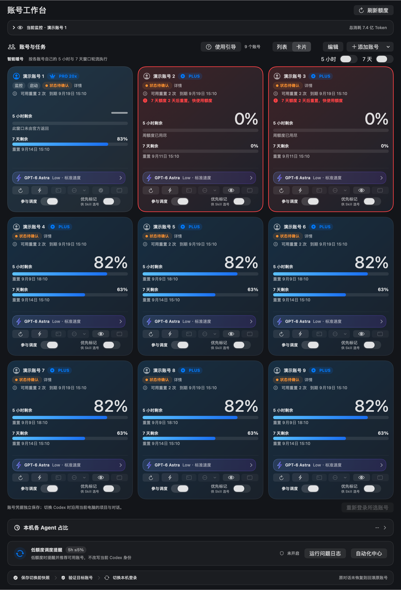

# Codex Account Manager Next

**中文** | [English](README.en.md)


每天打开 Codex，你可能都要重复确认几件事：哪个账号还有额度、什么时候重置、这次用什么模型、账号是不是已经被另一项任务占着。

Next 把这些放进一张 macOS 工作台。一个账号可以看额度、设暖号；多个账号可以分别保存 CLI 环境和执行偏好，开工前先看占用。

**一句话安装口令、4 个调用模板都在下面。** 当前版本 **0909v4 · 9.5.15 (29)**。本次更新源码、图片及本机安装，尚未发布该版本下载包。

[](https://github.com/BLACKIELF/codex-account-manager-next/actions/workflows/ci.yml)

[](LICENSE)

## 先装好，少做几次重复操作

把下面整段发给有本机执行能力的 Agent：

```text
请从 https://github.com/BLACKIELF/codex-account-manager-next 安装或升级 Codex Account Manager Next。先读 README，检查系统、依赖和已有安装；已有 Next 就记录当前设置，等待它自己的操作结束，备份后在原路径覆盖，不新增同名副本。保留账号、调度参与状态、模型偏好和当前 Codex 登录，安装后逐项核对设置与实际运行版本。不要终止其他 CLI 任务，也不要为验证而启动真实任务、切号或发送通知。需要官方登录时由我手动完成。
```

需要 macOS 13+、已正常登录的 Codex，以及 Xcode Command Line Tools。只有一个账号也能先用只读监控。CLI 与暖号还需要配置本机 Hub 和账号映射；没有配置时，相关入口保持关闭并提示原因。安装 Next 本身不会自动搭好 Hub。

自己构建：

```sh
git clone https://github.com/BLACKIELF/codex-account-manager-next.git
cd codex-account-manager-next
make build
```

App 位于 `build/CodexAccountManagerNext.app`。构建不会自动安装或启动；已有 Next 时先备份，在原位置替换。详见[安装与配置](docs/usage-guide.md#安装与配置)。本机构建使用 ad-hoc 签名，本版没有 Apple 公证下载包。

## 打开后，先看这张工作台



5 小时、7 天剩余额度和官方重置时间放在一起。官方没有返回的窗口显示“—”，不猜测它是无限额度。切换成列表可以连续查看更多账号；卡片适合横向比较，账号顺序与操作保持一致。

每个账号都能单独刷新、设模型、打开独立 CLI。执行偏好会传给后续任务，已有任务继续使用启动时的参数。新账号默认 **GPT-6 Astra / Low / 标准速度**；模型是否可用仍由目标账号和服务端决定。

> 界面图由本版生产 SwiftUI 组件原生渲染，使用演示账号、额度和日期，不读取个人凭据。图中的“状态待确认”表示未连接 Hub。[图片来源与制作提示词](docs/images/0909v4/README.md)

## 不用守着倒计时等暖号

5 小时与 7 天暖号分别设置。Next 到时先刷新官方额度，再核实账号身份和占用，条件满足才发送一次最小请求，尝试开启下一轮窗口。

需要 Next 持续运行、电脑唤醒并联网。暖号会消耗少量额度；账号忙碌、周额度用尽或状态不明时会等待复核，失败按间隔重试。成功后即使额度仍显示 100%，也不会因此每分钟重复暖号。

“参与调度”只决定能否接新任务。关闭后仍能刷新额度、检查会员日期，并按全局开关维护窗口。暖号不增加额度，也不使用重置券。

## 准备调用时，就让其他任务知道

通过配套调度协议调用时，先预约账号和工作目录，再做环境检查和启动。其他遵守协议的调用可以立即读到占用，Next 界面约每 10 秒更新。

| 你看到的状态 | 含义 |
|---|---|
| 在线·准备中 | 已占位，尚未证明真实执行 |
| 在线·运行中 | 有真实进程或 Hub 运行证据 |
| 在线·维护中 | 暖号或经过授权的维护占位 |
| 已结束·待验收 | 进程已结束，成果还要检查 |
| 状态待确认 | 信息不足，继续保留占用 |

同账号或同一真实项目目录的并发预约会被拒绝。心跳超时不会直接当成空闲。问题按日期追加到同一个日志，后续修复与验证接着记录；工作台有“运行问题日志”入口。

这套保护需要调用入口接入共享协议。旧 CLI、原生交互终端和直接绕过 Skill 的 Hub API 不会自动登记，仍需检查实际进程。Next 不会接管它们。[协议、接入条件与日志](docs/dispatch-coordination.md)

## 装好后，挑一个真实场景

这些口令交给能操作本机、且已配置相应工具的 Agent；它们不是 Next 内置的聊天指令。

**① 开工前看一眼**

```text
检查 Next 当前账号的 5 小时和 7 天剩余额度、上海时区重置时间、任务占用与模型偏好。先只读检查，区分新鲜数据、旧快照和未知状态。
```

**② 用指定账号做事**

```text
用账号 A 完成当前已授权任务。先核对目标环境所需工具、工作目录和账号身份，准备调用时立即占位，再刷新额度并验证占用。使用 Next 保存的执行偏好；不可用时不要静默换号。实际结束后及时读取成果、验收并释放占用。
```

**③ 排查暖号没有执行**

```text
检查 Next 的暖号开关、最近成功和失败记录、官方重置时间、周额度及账号占用。把本次发现按日期追加到同一运行问题日志，先给出最小验证，不通过真实请求反复试错。
```

**④ 升级后恢复原状**

```text
升级 Next 前保存当前设置、账号顺序、参与状态和模型偏好。先等待已有调用结束，再做维护占位和原位覆盖。完成后核对版本、恢复原设置、恢复接单开关并释放占位，不启动测试任务。
```

## 新用户打开后的默认设置

| 设置 | 默认值 |
|---|---|
| 语言、布局、外观 | 中文、列表、跟随系统、默认配色 |
| 菜单栏 | Classic，显示 7 天剩余额度，不显示重置倒计时 |
| 快捷键 | ⌘U |
| 新账号任务参数 | GPT-6 Astra / Low / 标准速度 |
| 窗口维护 | 5 小时与 7 天暖号开启 |
| 提醒 | 低额度、系统通知、飞书及两类额度事件开启 |
| 低额度提醒线 | 5 小时 ≤5%，7 天 <10%，可分别调整 |

已有设置优先，升级不会重新覆盖你保存的关闭选择。新用户仍会看到使用引导；系统通知要先获得 macOS 授权，飞书要先配置机器人，开关开启不等于已经送达。每个新账号默认参与调度，现有账号的参与选择保留。

## 这次具体修了什么

0909v4 相比 0909v3：统一新用户默认值；固定卡片额度字号；补齐排除调度账号的维护占用显示。继承 0909v3 的共享预约、暖号互斥、满额度重复暖号修复、同一问题日志、按实际结束时间收取结果及优先选号。

本轮验证覆盖 26 组纯测试、22 项 Python 协调测试、Python/Swift 文件锁互通，以及九账号在三种宽度、浅深色下的布局。本机覆盖安装和设置恢复另行核验。完整的官方重置周期、真实任务派单、Desktop 切号和通知送达不由这些测试证明。

[本版更新记录](docs/release-notes-v9.5.15.md) · [完整历史](CHANGELOG.md) · [详细使用说明](docs/usage-guide.md)

## 还有哪些功能

单账号菜单栏、完整 PNG 长截图、账号备注与排序、模型与思考强度选择、Standard/Fast、批量应用偏好、独立 Chrome 登录、显式 Desktop 切换、低额度推荐、飞书提醒、配色与工作区设置均保留。

Next 是独立的第三方开源项目。它不提供账号、不增加额度；独立 CLI 不改变当前 Desktop 登录，显式“切换 Desktop”才走身份切换事务。Webhook 保存在 Keychain。提交问题前请移除凭据、账号资料、任务正文和私有路径。

开发检查：

```sh
make build
scripts/run-self-tests.sh --skip-build --build-dir build
python3 tests/test_dispatch_activity.py
python3 tests/test-dispatch-activity-interop.py
make test-macos-compatibility
make memory-risk-check
git diff --check
```

本轮只开发和验证 macOS。Windows 源码保留，未进行本版验证。

[反馈问题](https://github.com/BLACKIELF/codex-account-manager-next/issues) · [安全说明](SECURITY.md) · [设计规范](docs/DESIGN_SYSTEM.md) · [MIT 许可](LICENSE) · [第三方声明](Resources/THIRD_PARTY_NOTICES.txt)
