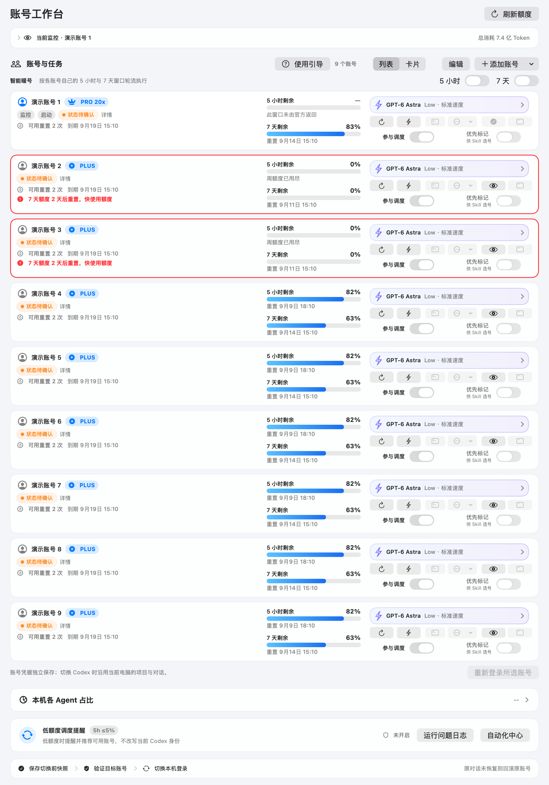

# AiGoodBro 使用说明 · 0911v1

本页保留 README 之外的配置和行为说明。当前源码预览为 0911v1 · 9.5.19 (33)，macOS 13+；尚无本版 Release 安装包。多 CLI 登录和真实调用尚未全部通过，不能用离线检查替代。

## 安装与配置

需要 Xcode Command Line Tools、Swift、Git、Make 和能正常登录的 Codex。缺少编译工具时，由用户完成 `xcode-select --install`。源码构建：

```sh
git clone https://github.com/BLACKIELF/AgentHub-AiGoodBro.git
cd AgentHub-AiGoodBro
make build
codesign --verify --deep --strict build/CodexAccountManagerNext.app
```

构建产物不会自动安装或启动。确认没有已有 Next 时，可以选择安装到当前用户目录：

```sh
mkdir -p "$HOME/Applications"
ditto build/CodexAccountManagerNext.app "$HOME/Applications/CodexAccountManagerNext.app"
open "$HOME/Applications/CodexAccountManagerNext.app"
```

软件在 Finder 中显示为 AiGoodBro，但应用包与执行文件仍是 `CodexAccountManagerNext`。已有版本时，先记录实际运行路径、设置和账号偏好，等待自己的操作结束，正常退出并备份后在原路径覆盖。不要改名为 `AiGoodBro.app`、新增第二份 App，也不要覆盖名称不同的旧管理器。构建脚本会拒绝覆盖正在运行的目标二进制；开发时可以指定独立 `BUILD_DIR`。

仓库的 `make install` 会删除 `/Applications/CodexAccountManagerNext.app`、复制新构建并立即打开，只适合用户明确批准且已完成备份的现场安装；普通构建和本轮离线验证不运行它。完整保留项见[品牌与安装兼容表](brand-compat-0911v1.md)。

第一次打开会显示包含环境准备的五步引导，可以跳过、续看和重新进入。通用偏好采用 README 中的默认值；账号、当前登录、机器人配置与“已完成引导”状态不会从其他用户复制。

下载包的 `Companion Skill/multi-agent-management` 包含可选调度 Skill 和中文安装说明。安装前检查已有同名 Skill；升级先备份，保留个人 `config`。公开示例处于停用状态，不会替你创建账号映射或 Hub。

单账号可以先监控当前 Codex。需要独立 CLI 时，在 Next 添加同一账号的隔离登录；它与系统入口不会被当成两个不同身份。登录、MFA 和 Chrome 账号选择由用户通过官方页面完成。

## 本版新增入口

- 工作台顶部选择已安装 CLI，关联已有登录目录并读取额度；[支持范围与账号隔离](local-cli-accounts.md)。
- 模型菜单的三个档位可改名称和组合；标准档保留已有主模型设置，另有 Sol High / Luna Max 子代理和 Luna Max 直接执行的初始组合。
- 环境准备先检查本机 Python 3.9+、Codex 和现有 Hub。配套 Skill 可更新；外部依赖按官方安装入口处理，已有服务不会被自动替换。
- 飞书消息选项控制 Agent、账号备注、额度、重置日期、重置卡到期明细和官方余额。默认简洁显示，卡片正文不包含长任务编号。
- 可用重置卡数量为绿色。选中账号后显示使用入口，三次确认后才允许请求；本版仅完成编译与静态审查，没有执行或测试该流程。
- 参与时段新增区间后立即显示并滚动到新行，按保存才生效，取消保留原设置。

## 账号动作



| 动作 | 作用 | 额度与身份 |
|---|---|---|
| 刷新 | 获取官方身份、额度、会员日期及重置时间 | 不发送任务生成请求 |
| 暖号 | 通过门禁后发送一次最小请求，再读额度 | 消耗额度；不切换 Desktop |
| 独立 CLI | 使用目标账号自己的 CODEX_HOME 和参数 | 任务消耗对应账号额度；不改 Desktop |
| 监控 | 选择工作台与菜单栏显示的账号 | 不切换登录 |
| 重新登录 | 通过官方流程更新目标登录 | 系统入口会影响系统登录；独立入口保留隔离 |
| 切换 Desktop | 显式改变 Codex App 当前登录 | 经过身份、任务、锁、写后核验及回滚事务 |

低额度推荐只给出候选提示，不自动派单或切号。开始 CLI 时还要重新检查当前占用。

Desktop 切换立即显示准备进度，等待已有刷新时可取消；来源和目标身份同时占位。后续检查在后台执行，再安全退出、打开和验证 Codex。源身份与预检不一致时取消，普通流程不会隐式强退；强制切换须通过明确提示。

账号备注最多 40 个字符；长备注可以省略，详情保留完整显示。编辑模式支持排序、改名和移除；排序提交一次，取消拖动不写顺序。删除账号会将目标资料移到废纸篓，不删除平台账号。

## 模型与参数

新账号默认 `gpt-6-astra / low / default`。已有保存参数优先。界面支持的模型与推理强度：

| 模型 | 可选思考强度 | 速度 |
|---|---|---|
| GPT-6 Astra、5.6 Sol、5.6 Terra | Low、Medium、High、XHigh、Max、Ultra | Standard / Fast |
| 5.6 Luna | Low、Medium、High、XHigh、Max | Standard / Fast |
| GPT-5.5、GPT-5.2 | Low、Medium、High、XHigh | GPT-5.5 支持 Fast；GPT-5.2 仅 Standard |

以上是本版参数校验表，不保证每个账号获得服务端访问。无效组合被拒绝，不静默降级。修改用于后续 CLI 及其默认子 Agent；“应用到所有账号”是一次批量设置，不持续覆盖之后的单独调整。

暖号固定使用轻量维护模型，不跟随任务偏好。费用估算不等于订阅账单。

## Hub 与共享占用

Hub 是另外运行的本机服务。Next 读取 `127.0.0.1:8787/api/overview` 和预配置账号映射，不负责安装 Hub 或替它创建真实任务。缺少可信映射、任务列表或新鲜概览时，CLI 与暖号保持关闭。

调度编号保存在 Next 支持目录的 `dispatch-codes-v1.json`。编号是唯一的大写字母，关联本机已有 profile 与 Hub alias。通过“参与调度”进行受验证的三源同步；关闭后保留原字母，重新加入沿用。不要各自手改三份配置。

共享占用把准备、运行、维护与待验收阶段写入 `dispatch-activity-v1.json`。Next 暖号和接入协议的调度器共用账号锁；本机 UI 也能按身份哈希显示排除调度账号的维护占用。释放维护记录后，原有映射门禁继续生效。

Next 新建的独立终端会等待私有启动回执，并以进程指纹维护占用；终端退出不等于模型任务验收成功。配套 Hub 在创建和批准时检查共享占用，旧交互 CLI 和旧 Hub 仍需单独检查。详见[接入说明](dispatch-coordination.md)。

“参与调度”旁的时钟支持不限时、仅在所选时段参与、排除所选时段。可选星期、IANA 时区和跨午夜范围；空允许规则不接单。时段只控制新任务，额度刷新和暖号继续遵循各自开关。

## 暖号与提醒

5 小时与 7 天维护分别跟随全局开关，不受账号是否参与调度影响。到期先刷新，身份、额度和任务证据有效才请求；忙碌则等待。失败至少延后 5 分钟复核。周额度耗尽时继续刷新恢复状态，暂缓暖号。

满额度并不是新一轮窗口的证据。本版用重置事件代次区分已处理事件和请求途中出现的新事件；成功会确认本次处理事件，避免继续每分钟发送。官方 reset 与本地维护计划分别显示，以实际官方结果判断窗口是否更新。

低额度提醒线默认 5 小时 ≤5%、7 天 <10%，两者可分别选 5/10/15/20/25%。推荐还要求可信任务状态、用户离开 Codex 前台、参与选择和间隔等条件；没有候选时不制造通知。

系统通知开关默认开启，但要由用户主动授予 macOS 权限。飞书开关及额度重置、Reset 卡增加两类事件默认开启，机器人未配置时只显示待配置。Webhooks 保存在 Keychain，不回填到界面或日志。真实测试发送由用户明确点击。

首次使用可直接在引导的提醒页面粘贴机器人地址，点击“保存并连接”。已有连接若需要钥匙串权限，点击“授权连接”；电脑密码仅在 macOS 系统弹窗输入，如有“始终允许”可选择记住授权。后台读取遇到权限不足会安静暂停飞书发送，在界面显示待授权，不会反复弹窗，也不影响本机重置消息。保存、授权和移除均在后台执行。当前 ad-hoc 签名随版本变化，升级后可能需要重新授权一次。

“自动化中心”首项“重置消息”默认开启，每 5 分钟查询第三方公开记录，不消耗账号额度，不需要飞书。首次建立历史基线，后续新消息通过本机通知；无通知权限仍可在面板查看。飞书转发展开“同时发送到飞书（可选）”配置。公开公告不会改写账号官方重置记录，也不会兑换重置卡。

旧记录恢复有每轮条数和时间上限，后续失败不会丢掉已校验页面。历史缺口会明确显示；选择“从当前消息继续接收”后，保留原待发与待核实记录，当前历史不补发，之后的新消息继续提醒。

## 截图、外观与工作区

右上角相机按钮通过生产 SwiftUI/AppKit 组件导出当前完整工作台，包含滚动区外账号，不截其他窗口或临时弹窗。原生保存面板由用户选择 PNG 位置，不自动上传。正常导出为 2×；大图降为 1×，超出 3200 万像素或单边 32768 像素时提示调整，不静默裁切。

设置分为外观、菜单栏、自动化、工作区、关于。支持中文 / English、跟随系统 / 浅色 / 深色、内置配色、菜单栏密度与指标、置顶、后台驻留、统计时区、Runtime 来源和全局快捷键，并尊重减少动态效果。

菜单栏默认 Classic，显示 7 天剩余额度。可以选择已用口径、多窗口指标、今日 Token 和重置倒计时。自动更新检查优先读取 `BLACKIELF/AgentHub-AiGoodBro` 的公开 Release；新仓库尚未就绪而返回 404 时，兼容读取旧仓库名。检查保持只读，不静默安装。

## 数据与恢复

AiGoodBro 继续使用 Next 的 bundle ID `com.blackielf.codex-account-manager-next`。账号、支持文件与缓存仍使用原 Next 命名空间：

```text
~/.codex-account-manager-next/profiles/
~/Library/Application Support/CodexAccountManagerNext/
~/Library/Caches/CodexAccountManagerNext/
```

独立 CLI、纯刷新与暖号不修改当前 Desktop 身份。显式 Desktop 切换、系统账号重新登录及未完成切换恢复可能写系统登录。切换使用身份核验、专属锁、优雅退出、原子写入、写后验证与安全回滚；有任务或身份证据不明时不继续。

运行问题始终追加到同一个 `operations-issues-v1.jsonl`，包含日期、问题标识、阶段、脱敏编号和证据引用。不能把日志条数当成已经解决的数量。

卸载 App 不自动删除账号、设置或 Keychain。需要删除这些资料时另行明确操作。

## 排查入口

- CLI 灰色：检查当前 Hub 概览、可信映射、共享预约及真实进程；“未知”不等于“空闲”。
- 暖号没执行：看开关、最近结果、周额度、占用和官方重置；失败会延迟复核。
- 额度显示“—”：官方未返回该窗口，或本次读取失败；查看旁边说明与详情。
- 通知没显示：区分开关、系统授权/机器人配置、发送结果以及实际送达。
- 升级后状态不符：核对实际运行路径、版本、单实例和保存偏好，不先删数据重装。

[README](../README.md) · [安全说明](../SECURITY.md) · [变更历史](../CHANGELOG.md)

### 紧凑卡片与清晰推送

卡片并排显示两种额度，最窄工作台可放三列；重置时间保留在额度下方，完整暖号与官方重置记录在账号“详情”。飞书使用账号编号与备注，不再用内部编号替代可辨识名称。连接测试只说明手动测试；低额度提醒显示具体剩余值、实际命中的阈值和推荐账号，不声称已经切换。
